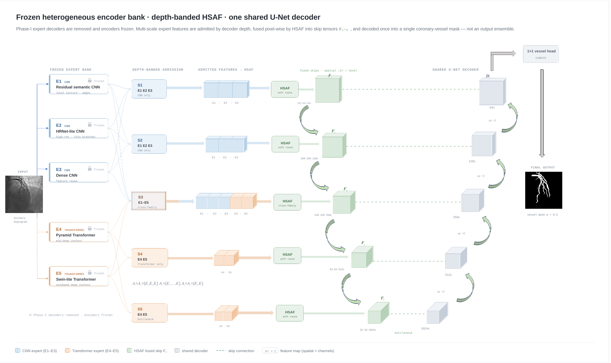

# DEFT-Net

**Depth-banded, pixel-wise routing of fold-perspective frozen heterogeneous
experts for coronary X-ray angiography vessel-tree segmentation.**

[](https://www.python.org/)
[](https://pytorch.org/)
[](LICENSE)
[](docs/RELEASE_NOTES_v0.2.0.md)
[](https://github.com/ShikiRyo1/DeftNet_coronary-vessel-semantic-segmentation/actions/workflows/ci.yml)

This repository contains the reference implementation and public aggregate
artifacts for the current DEFT-Net CMIG manuscript. The method is trained in
two phases. Five heterogeneous expert segmentors first specialize on five
complementary four-fifths views of the training set. Their decoders are then
removed, the encoders are frozen, and HSAF routes admitted same-scale features
into one shared U-Net decoder. The final prediction is produced once; DEFT-Net
is not an output ensemble.



## What changed in v0.2.0

- aligned public expert identifiers with the paper: `E1`-`E5`;
- added deterministic fold-perspective manifests and Phase-I training;
- made Phase-II training require the five Phase-I encoder checkpoints;
- aligned both phases to `0.50 BCE + 0.50 Dice`, 60 epochs, AdamW, cosine
  scheduling, mixed precision, and gradient clipping;
- added legacy v0.1.x config/checkpoint migration;
- expanded fixed-threshold structural evaluation and updated the current
  public aggregate tables;
- replaced the previous architecture graphic and deprecated terminology.

## Method at a glance

| Expert | Public description | Family | Phase-I view |
|---|---|---|---|
| E1 | residual semantic CNN | CNN | all training samples except fold 1 |
| E2 | HRNet-lite CNN | CNN | all training samples except fold 2 |
| E3 | dense CNN | CNN | all training samples except fold 3 |
| E4 | pyramid Transformer | Transformer | all training samples except fold 4 |
| E5 | Swin-lite Transformer | Transformer | all training samples except fold 5 |

The fixed depth-banded admission policy is:

| Feature scale | Admitted experts | Role |
|---|---|---|
| `e1`, `e2` | E1, E2, E3 | high-resolution local evidence |
| `e3` | E1, E2, E3, E4, E5 | cross-family competition |
| `e4`, `e5` | E4, E5 | wider contextual evidence |

At each scale, all five adapted feature maps condition the HSAF router. Logits
of experts outside the fixed admission set are masked before the temperature-
scaled softmax (`tau=1.5`), so only admitted experts contribute to the fused
tensor. The shared decoder consumes `e5` as its bottleneck input and uses the
fused `e4`-`e1` tensors as skip features.

## Current fixed-protocol benchmark

The current public summary uses 1,760 released coronary angiography images,
split into 1,408 training, 176 validation, and 176 held-out test images. Results
use seeds `0`, `42`, and `44`, a fixed threshold of `0.5`, and no test-time
augmentation.

| Model | Dice | IoU | Sens. | Prec. | MCC | clDice | cbDice | HD95 (px) | ASSD (px) |
|---|---:|---:|---:|---:|---:|---:|---:|---:|---:|
| **DEFT-Net** | **0.8264 +/- 0.0056** | **0.7042 +/- 0.0081** | **0.8490 +/- 0.0036** | **0.8186 +/- 0.0065** | **0.8237 +/- 0.0055** | **0.9025 +/- 0.0240** | **0.8086 +/- 0.0010** | 42.46 +/- 1.25 | 7.21 +/- 0.58 |
| U-Mamba | 0.8103 +/- 0.0100 | 0.6906 +/- 0.0143 | 0.8186 +/- 0.0105 | 0.8147 +/- 0.0090 | 0.8066 +/- 0.0099 | 0.8999 +/- 0.0422 | 0.7908 +/- 0.0064 | 47.4616 +/- 4.9820 | 8.4582 +/- 1.3173 |
| SegFormer | 0.8084 +/- 0.0075 | 0.6861 +/- 0.0104 | 0.8272 +/- 0.0103 | 0.8026 +/- 0.0039 | 0.8045 +/- 0.0074 | 0.8963 +/- 0.0444 | 0.7917 +/- 0.0032 | 45.2430 +/- 6.5060 | 7.7948 +/- 1.5004 |

The full 15-method summary is in
[`experiments/pooled_public_fixed_notta_seed_summary_v277.csv`](experiments/pooled_public_fixed_notta_seed_summary_v277.csv).
HD95 and ASSD are boundary-distance guardrails, not claimed as universal wins.
Mechanism and full-data controls are reported separately so that benchmark and
ablation evidence are not conflated.

## Installation

```bash
git clone https://github.com/ShikiRyo1/DeftNet_coronary-vessel-semantic-segmentation.git
cd DeftNet_coronary-vessel-semantic-segmentation
python -m venv .venv
```

Windows:

```powershell
.venv\Scripts\Activate.ps1
pip install -e ".[dev]"
pytest -q
```

Linux/macOS:

```bash
source .venv/bin/activate
pip install -e ".[dev]"
pytest -q
```

## Dataset layout

```text
data_root/
  train_images/    train_masks/
  val_images/      val_masks/
  test_images/     test_masks/
```

Images are read as single-channel inputs and resized to `512 x 512`; masks use
nearest-neighbour resizing. Dataset files are not redistributed. See
[`docs/DATA.md`](docs/DATA.md) for scope, harmonization, and release boundaries.

## Reproduce the two-stage training protocol

### 1. Create the complementary-view manifest

```bash
python scripts/make_perspective_folds.py \
  --data-root path/to/data_root \
  --output manifests/perspective_folds_seed2026.json \
  --folds 5 --seed 2026
```

The assignment is deterministic and near-balanced. Expert `Ei` omits fold `i`
during Phase I; every held-out fold remains part of the global training split,
not the final validation or test set.

### 2. Train the five Phase-I expert segmentors

```bash
python scripts/train_phase1.py --data-root path/to/data_root \
  --perspective-manifest manifests/perspective_folds_seed2026.json \
  --expert E1 --omit-fold 0 --seed 42 --output-dir runs/phase1
```

Repeat for `E2`-`E5` with omitted folds `1`-`4`. The best validation checkpoint
contains both the full Phase-I segmentor and an `encoder_state_dict` for Phase
II.

### 3. Train HSAF and the shared decoder

```bash
python scripts/train.py --data-root path/to/data_root --seed 42 \
  --expert-checkpoint E1=runs/phase1/E1_omit_fold0_seed42/best.pth \
  --expert-checkpoint E2=runs/phase1/E2_omit_fold1_seed42/best.pth \
  --expert-checkpoint E3=runs/phase1/E3_omit_fold2_seed42/best.pth \
  --expert-checkpoint E4=runs/phase1/E4_omit_fold3_seed42/best.pth \
  --expert-checkpoint E5=runs/phase1/E5_omit_fold4_seed42/best.pth
```

Run the same pipeline for seeds `0`, `42`, and `44`. Phase-II training refuses
to proceed when an expert checkpoint is missing. `--allow-random-experts`
exists only for synthetic smoke tests and must not be used for paper results.

## Evaluation and inference

```bash
python scripts/evaluate.py \
  --checkpoint runs/deftnet_phase2/seed42/best.pth \
  --data-root path/to/data_root --split test --threshold 0.5

python scripts/infer.py \
  --checkpoint runs/deftnet_phase2/seed42/best.pth \
  --image example.png --output mask.png --threshold 0.5
```

Additional utilities:

- `scripts/per_image_metrics.py`: fixed-threshold per-image overlap, centerline,
  branch, component-count, and boundary metrics;
- `scripts/paired_stats.py`: paired bootstrap, Wilcoxon, rank-biserial effect
  size, and explicitly scoped Holm correction;
- `scripts/make_split_manifest.py`: image/mask checksums and split provenance;
- `scripts/profile_model.py`: parameter, MAC, latency, and VRAM reporting;
- `scripts/make_gallery.py`: deterministic TP/FP/FN qualitative panels.

## Reproducibility boundary

- The public package contains code, configs, aggregate tables, and
  non-sensitive figures; it does not redistribute third-party angiograms,
  masks, private metadata, trained weights, or per-image exports.
- The primary evidence is a released-image benchmark. It is not described as
  patient-, procedure-, site-, or external clinical validation where the public
  releases do not provide the corresponding identifiers.
- Frozen experts remain active at inference. The paper-aligned plain U-Net
  implementation in this release has 1,862,074 Phase-II trainable parameters
  and 12,364,598 total inference parameters; both quantities should be reported
  together. The counts are covered by a regression test.
- Legacy v0.1.x expert identifiers are migrated automatically, but new configs
  and checkpoints should use `E1`-`E5`.

See [`docs/REPRODUCIBILITY.md`](docs/REPRODUCIBILITY.md),
[`docs/MODEL_CARD.md`](docs/MODEL_CARD.md), and
[`docs/EXPERIMENT_DESIGN_SUMMARY.md`](docs/EXPERIMENT_DESIGN_SUMMARY.md).

## Citation

Until a citable manuscript record is available, cite the software release:

```bibtex
@software{wu2026deftnet,
  author = {Yuhui Wu},
  title  = {DEFT-Net: Depth-Banded Routing of Fold-Perspective Frozen Heterogeneous Experts},
  year   = {2026},
  version = {0.2.0},
  url    = {https://github.com/ShikiRyo1/DeftNet_coronary-vessel-semantic-segmentation}
}
```

## License

MIT. Dataset-specific licenses and terms remain in force for external data used
with this code.
