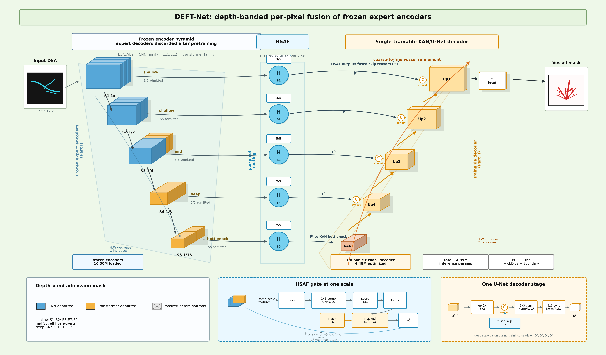

# DeftNet / DEFT-Net

**Depth-banded frozen-expert fusion for coronary vessel semantic segmentation.**

DeftNet is the public code package for the DEFT-Net research project. The model
uses independently trained heterogeneous expert encoders, freezes those encoders,
then fuses multi-scale features with a depth-banded spatial adaptive fusion gate
before a single decoder predicts the vessel mask.



## Highlights

- **Frozen heterogeneous experts**: CNN-style, HRNet-style, DenseNet-style, and Transformer-style encoders are trained as separate experts, then frozen for fusion-stage training.
- **Depth-banded fusion**: shallow features are routed to local-detail experts, mid-level features allow broader competition, and deep features use Transformer-family experts by default.
- **Single decoder**: expert decoders are discarded after pretraining; only fused encoder pyramids feed the final decoder.
- **Audited evaluation protocol**: the main DCA result uses a fixed threshold, no test-time augmentation, and a held-out true-test split.
- **Reproducible release shape**: installable package, config files, training/evaluation scripts, experiment tables, citation metadata, and a model-card style summary.

## Main DCA Result

The conservative main-table protocol is **fixed threshold 0.5 + no TTA** on the
held-out DCA true-test set (`n=134`). More optimistic TTA/oracle-threshold scores
are treated only as sensitivity results.

| Rank | Model | Dice | IoU | Sens. | Prec. | clDice | HD95 ↓ | ASSD ↓ |
|---:|---|---:|---:|---:|---:|---:|---:|---:|
| 1 | **DeftNet / DEFT-Net** | **0.8196** | **0.7034** | **0.8391** | **0.8161** | **0.8444** | **40.44** | **6.86** |
| 2 | HRNet | 0.8085 | 0.6872 | 0.8308 | 0.8060 | 0.8280 | 44.91 | 7.79 |
| 3 | SegFormer | 0.8081 | 0.6862 | 0.8207 | 0.8109 | 0.8320 | 43.42 | 7.21 |
| 4 | U-Mamba | 0.8074 | 0.6849 | 0.8179 | 0.8113 | 0.8270 | 45.55 | 7.53 |
| 5 | U-Net | 0.8043 | 0.6821 | 0.8367 | 0.7940 | 0.8244 | 50.07 | 8.60 |

Full fixed-protocol results are in
[`experiments/dca_fixed_notta_results.csv`](experiments/dca_fixed_notta_results.csv).

## Installation

```bash
git clone https://github.com/ShikiRyo1/DeftNet.git
cd DeftNet
python -m venv .venv
.venv\Scripts\activate  # Windows
pip install -e ".[dev]"
pytest
```

Linux/macOS:

```bash
python -m venv .venv
source .venv/bin/activate
pip install -e ".[dev]"
pytest
```

## Dataset Layout

The scripts expect binary masks in a simple folder layout:

```text
data_root/
  train_images/
  train_masks/
  val_images/
  val_masks/
  test_images/
  test_masks/
  true_test_images/      # optional held-out final split
  true_test_masks/
```

Third-party datasets and clinical images are not included in this repository.
See [`docs/DATA.md`](docs/DATA.md) for the release and citation policy.

## Training

```bash
python scripts/train.py \
  --config configs/dca_five_expert.yaml \
  --data-root path/to/data_root \
  --output-dir runs/deftnet_dca
```

The default config freezes all expert encoders during the fusion stage. If you
need to reproduce an older checkpoint that used a three-expert deep band, use
`configs/legacy_three_deep_experts.yaml`.

## Evaluation

```bash
python scripts/evaluate.py \
  --config configs/dca_five_expert.yaml \
  --checkpoint runs/deftnet_dca/best.pth \
  --data-root path/to/data_root \
  --split true_test \
  --threshold 0.5
```

## Inference

```bash
python scripts/infer.py \
  --config configs/dca_five_expert.yaml \
  --checkpoint runs/deftnet_dca/best.pth \
  --image example.png \
  --output mask.png
```

## Repository Map

```text
src/deftnet/                 installable PyTorch package
scripts/                     train, evaluate, infer entry points
configs/                     audited and legacy architecture configs
experiments/                 public result tables and ablation summaries
docs/                        protocol, data, model card, experiment audit
assets/                      architecture and non-sensitive result figures
tests/                       CPU smoke tests
```

## Experiment Design

The project was audited around this main evidence chain:

1. Protocol hygiene and operating-point definition.
2. Primary coronary DSA benchmark under fixed threshold/no-TTA.
3. Statistical and robustness support for the DCA gain.
4. Parameter and inference-cost profile.
5. Mechanism ablations for expert diversity, freezing, and depth-banding.
6. Fusion and false-positive mechanism analysis.
7. Coronary vessel-structure surrogate evaluation.
8. Auxiliary cross-dataset robustness.
9. Failure modes and claim boundaries.

See [`docs/EXPERIMENT_DESIGN_SUMMARY.md`](docs/EXPERIMENT_DESIGN_SUMMARY.md)
and [`docs/REPRODUCIBILITY.md`](docs/REPRODUCIBILITY.md).

## Important Limitations

- The public package currently contains code, configs, result tables, and
  non-sensitive figures. Dataset redistribution and trained checkpoints require
  separate release decisions.
- The code is a cleaned, notebook-free reference implementation. Exact parameter
  counts may differ from legacy internal checkpoints unless the matching config
  and checkpoint are released together.
- The DCA split used in the audit is frame-level. It is held-out at the frame
  level, but not claimed as patient/procedure-level validation unless metadata
  later verifies that property.
- HSAF is presented as an adaptive and interpretable fusion mechanism. The audit
  does **not** claim that HSAF is statistically superior to simple mean fusion
  on every metric; see `experiments/fusion_hsaf_vs_mean.json`.

## Citation

If this repository helps your research, please cite the repository for now:

```bibtex
@software{deftnet2026,
  title  = {DeftNet / DEFT-Net: Depth-Banded Frozen-Expert Fusion for Coronary Vessel Segmentation},
  year   = {2026},
  url    = {https://github.com/ShikiRyo1/DeftNet}
}
```

## License

MIT. Dataset-specific licenses and terms still apply to any external data used
with this code.
